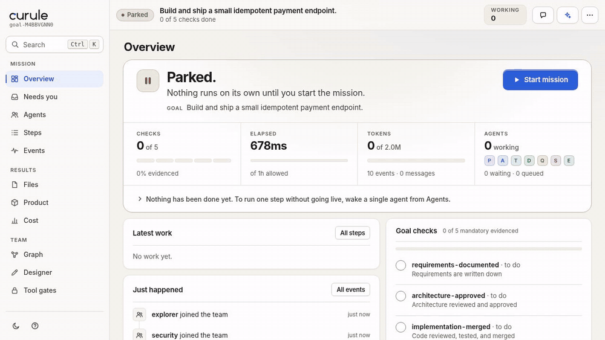

<h1 align="center">
  <picture>
    <source media="(prefers-color-scheme: dark)" srcset="brand/curule-logo-dark.svg">
    
  </picture>
</h1>

<p align="center"><b>A team of AI agents, run like an organization.</b></p>

A standalone runtime for **persistent AI organizations**. Not "many LLMs in a
group chat" — autonomous role-based agents that collaborate through explicit
**authority**, **communication contracts**, **artifacts**, **dynamic
activation**, and an **event-sourced** kernel with runtime-enforced policy.

```
Agent = Role + Persistent Session + Capabilities + Authority
      + Relationships + Memory + Lifecycle + Delegation Policy
```

The workflow is **not** a fixed pipeline. A goal seeds initial state; agents
wake on events they care about, act via typed messages and artifact references,
and the mesh converges — or escalates on conflict, budget exhaustion, or
stalemate.

It runs on your own infrastructure with your own model credentials, and nothing
phones home. The Community plan (one open project, up to eight agents) needs no
licence key; the paid plans lift the limits (see [pricing](docs/commercial/pricing.md)).
The source is public under the Business Source License 1.1: see [Licence](#licence).

## Demo



Recorded from the token-free `demo-stub` run (parked console → start mission):
requirements → research → design review → implementation → QA block with rework →
merge → release gates → evidence-based completion. No model calls, no API keys;
run it yourself with `npm run curule -- run examples/demo-stub/mesh.yaml`.
Regenerate the GIF with `npm run demo:capture` (needs a built repo, Chrome/Chromium, and ffmpeg).

## Quick start (no model, no keys)

```bash
npm install
npm run build
npm test                         # several thousand tests: protocol, policy,
                                 # scheduler, lifecycle, replay, integration,
                                 # properties, simulation, git worktrees, adapters,
                                 # HTTP/MCP, security, licensing, deployment assets,
                                 # the demo journey, parked/step/live modes
npm run curule -- run examples/demo-stub/mesh.yaml
# then open http://127.0.0.1:7421/ and watch a whole AI organization
# discover its own workflow — no fixed pipeline, budget events, review
# gates, a QA block with rework, and evidence-based completion.
```

## Run it as a service

The same runtime ships as a container image, a Compose file and a Helm chart, for running it for a team:

```bash
docker build -t curule .
docker run --rm -p 127.0.0.1:7420:7420 -v mesh-demo:/data \
  -e MESH_API_TOKEN="$(openssl rand -hex 32)" curule demo     # the scripted demo: no API key
```

Open <http://127.0.0.1:7420>, sign in with the token, open **demo-stub**, press **Start mission** and confirm. The server
refuses to listen on a network address without a token of 32 or more characters, so anything beyond your own machine
needs a real token and TLS in front of it ([one Compose overlay does that](docs/commercial/deployment.md#tls-and-a-reverse-proxy)).
Tagged releases publish the image as `ghcr.io/salitaba/curule`.

| Read | For |
|---|---|
| [docs/commercial/deployment.md](docs/commercial/deployment.md) | trying it, Docker Compose, Kubernetes with Helm, one instance per tenant, air-gapped installs |
| [docs/operations.md](docs/operations.md) | every setting, upgrading, backups, monitoring, what each refusal means |
| [docs/commercial/security.md](docs/commercial/security.md) | what it protects and what it does not; [SECURITY.md](SECURITY.md) to report a vulnerability |
| [docs/commercial/pricing.md](docs/commercial/pricing.md), [docs/commercial/licensing.md](docs/commercial/licensing.md) | the plans, their limits, licence keys and how limits are enforced |

The agents use model credentials that belong to you: any provider the native runtime speaks (OpenAI-compatible chat
completions, which most providers and local model servers offer, or the Anthropic API), or Claude Code with an Anthropic API
key or Amazon Bedrock, Google Vertex or Microsoft Foundry credentials. A self-hosted Curule never resells or touches model
usage; the plans are for the runtime.

## Product tour (the three journeys)

1. **Watch** — `curule run` (or `curule ui` for a parked console): the Overview
   shows progress, tokens, and a guidance banner for every state (parked,
   paused, escalated, asleep, complete). Agents view → click a seat for its
   whole definition, memory, session and mailbox. Graph shows who talks to
   whom and how. Events streams live from the append-only log; click any
   event for its JSON. Artifacts show immutable lineage; Cost shows the
   budget ledger.
2. **Steer** — the console has three tiers: **parked** (nothing self-runs),
   **manual step** (a seat's *wake* button runs exactly one operator turn —
   step the mesh agent by agent), and **live** (▶ *Start mission* flips the
   parked console into full autonomous execution without restarting). Every
   button answers honestly: refusals come back as `409` with the reason
   ("mission is paused — resume it first", …). The human is a seat, not an
   oracle: `✉ message` sends typed messages (highest provenance), `✓ approval`
   records decisions that gates consume, wake/suspend/resume per agent,
   pause/resume the mission, respond-to-escalation resumes work with the
   raiser woken. Or use the CLI (`curule approve --subject release`,
   `curule respond <esc> "…"`, …).
3. **Design** — `#/designer` in the dashboard: build agents, capabilities, authority,
   interests, the communication matrix, transition gates and budgets with
   live server-side validation (same engine as `curule validate`), YAML preview,
   save; then `curule run <saved path>`. `curule init` scaffolds a starter with
   `runtime: claude` — there is no PATH probe and there should not be, because
   that executable ships with the SDK this repo already depends on, so a probe
   would fail on a working install. Set `runtime: stub` by hand for a mesh that
   boots and runs with zero model calls.

## Running

All commands go through `npm run curule -- <command>` (or `node dist/apps/mesh-cli/src/index.js <command>`):

```bash
# full runtime — scheduler active, agents execute, dashboard live:
npm run curule -- run examples/demo-stub/mesh.yaml
#   first run? this demo auto-attaches a scripted payment-API team (zero model
#   calls): requirements → research → design → review → delegate → implement →
#   QA BLOCK → rework → merge → release gates → evidence-based completion.
#   Watch it live at  http://127.0.0.1:7421/   (dashboard + controls),
#   design at         http://127.0.0.1:7421/#/designer
#   (--no-demo disables the scripted team; agents then simply idle)

# PARKED CONSOLE — dashboard + designer, nothing autonomous (no startup runs,
# no cascades, no tokens), safe to poke at even for a config whose runtime is
# not installed on this machine:
npm run curule -- console examples/payment-api/mesh.yaml --port 7430
# (alias: ui; equivalent: npm run curule -- run <file> --parked)
# parked semantics: startup/interest/timer cascades are all off — nothing runs
# on its own. BUT operator buttons stay live: "wake" runs exactly one manual
# turn (step through the mesh agent by agent), "send + wake after send" delivers
# mail and steps recipients in one action, and the Start mission button flips
# the console live in place (scheduler on, cascades resume) without restarting.

# design first, run later:
npm run curule -- init my-mesh                       # writes a starter mesh.yaml
                                                   # with runtime: claude
npm run curule -- init my-mesh --runtime stub        # the same on the stub runtime: no model calls
npm run curule -- init my-mesh --example payment-api # a shipped example (curule init --list shows them)
$EDITOR my-mesh/mesh.yaml                          # or use the designer page
npm run curule -- validate my-mesh/mesh.yaml
npm run curule -- run my-mesh/mesh.yaml

# deterministic mesh-vs-single-agent benchmark (token-free):
npm run curule -- bench

# many projects under one host (what the container runs), plan, and consumption:
npm run curule -- host --port 7420
npm run curule -- project add ./my-mesh
npm run curule -- license status                     # plan, limits and licence state of this install
npm run curule -- usage --all                        # what the meshes consumed, from their logs
npm run curule -- doctor                             # diagnose this install; safe to paste into a ticket

# operate a running mesh from the CLI:
npm run curule -- status
npm run curule -- graph
npm run curule -- events --limit 30
npm run curule -- agents
npm run curule -- inspect qa
npm run curule -- replay <goalId>
npm run curule -- pause
npm run curule -- resume
npm run curule -- approve --subject release
npm run curule -- send --to architect --type MISSION --payload "{\"note\":\"go\"}"
npm run curule -- respond <escalationId> "approved, proceed"
```

Real LLM collaboration needs a model backend:

- `runtime: claude` — Claude Code via `@anthropic-ai/claude-agent-sdk`. Nothing
  to install: the SDK is a declared dependency and ships its own executable.
- `runtime: native` — the provider-neutral runtime: Curule calls the model itself,
  on any provider that speaks OpenAI-compatible chat completions or the Anthropic
  Messages API, including local model servers. Providers and keys are named in
  `mesh.runtime.providers`; `curule providers check` proves a provider and a model
  before a mission runs. See [docs/runtime-native.md](docs/runtime-native.md).
- `runtime: stub` — no model calls at all, for offline runs and tests.

`runtime: opencode` was removed. A config that still names it fails to load,
with an error pointing at the agents that do.

Set it per agent, or mesh-wide via `mesh.runtime.default`. Add `--git` to give
writing agents real git worktrees.

Other helpers: `emit-schemas schemas` (regenerate canonical JSON schemas),
`curule mcp` (internal stdio↔HTTP bridge, spawned by the Claude adapter to
reach `/api`).


## Repository layout

```
packages/
  protocol        typed model, canonical event catalog, JSON schemas, ids, clock
  config          mesh.yaml load + schema + cross-field validation, role prompts
  event-store     append-only JSONL event log, replay stream
  persistence     state layout, session registry, snapshots, sqlite index
  core            kernel, projections, lifecycle, budgets, termination, deadlock,
                  context construction, supervisor, delegation, workers
  policy-engine   4-layer enforcement, communication matrix, transition gates
  scheduler       interest registry, activation, mailboxes, concurrency, triage
  agent-runtime   adapter interface + deterministic StubRuntime (tests/sim)
  artifact-store  immutable content store + git worktree manager
  projects        multi-project registry (~/.curule/projects.json)
  licensing       offline licence keys (Ed25519), the plan table, entitlements, pricing export
  llm               the model port: OpenAI-compatible and Anthropic Messages adapters, no vendor types
  runtime-native    provider-neutral runtime: the agent loop, the seat's tools, conversations on disk
  ai-gateway        the model gateway of the hosted service: virtual keys, a price table, an append-only ledger,
                    tiers with failover, OpenAI-compatible chat completions in and any provider out
  runtime-claude    Claude Code adapter (Agent SDK, long-lived streaming query)
  runtime-http      generic HTTP/custom/remote agent adapter
  observability     graph, goal/artifact/cost views, metrics, SSE hub
apps/
  mesh-cli        curule init|validate|run|ui|status|graph|events|replay|approve|… + TUI
  mesh-server     bootstrap + HTTP/SSE API + MCP bus + config-designer API + static UI
  mesh-dashboard  live UI + mesh designer (Vite + React + TS SPA in `src/`,
                  built to `dist/` and served by mesh-server on the same port)
  cloud-server    the hosted service's processes: `npm run cloud -- gateway --config gateway.yaml`
deploy/           Helm chart, fleet provisioning script, container entrypoint
site/             static landing and pricing page (its numbers are generated from the plan table)
pricing/          the measured mission and the generated plan data
tools/license/    mesh-license.mjs: key generation and signing (a vendor tool; the private key stays offline)
Dockerfile, docker-compose.yml
schemas/ roles/ examples/ tests/ docs/
```

UI development: `npm run dev` boots a parked demo console plus the dashboard
with hot reload (API at :7421, UI at :5173) — parked never auto-completes,
so the session stays up while you wake agents and drive flows by hand;
`npm run dev:ui` starts only the UI against an already-running mesh.
`npm run build:ui` rebuilds the dashboard bundle (`npm run build` already
includes it).

Hot reload against your own mesh + port (the console port serves the stale
built bundle — open the Vite URL, not the mesh port):

```bash
# terminal 1 — your mesh (stays running; agents keep their state):
npm run curule -- console examples/line-follower-sim/mesh.yaml --port 7430

# terminal 2 — hot-reloading UI proxied at your mesh:
MESH_BUS_URL=http://127.0.0.1:7430 npm run dev:ui
# open http://127.0.0.1:5173/ — edits under apps/mesh-dashboard/src/ reload live.
```

See `docs/architecture.md`, `docs/protocol.md`, `docs/configuration.md`,
`docs/runtime.md`, `docs/operations.md` and `docs/commercial/README.md`.

## Positioning

A runtime for persistent AI organizations, where autonomous role-based
agents collaborate through explicit authority, communication contracts,
artifacts, and dynamic activation. The benchmark (`curule bench`) is intentionally
honest: the mesh may win on some software workloads and lose on others; the
project measures rather than assumes. The one real mission measured so far
(five agents on Haiku 4.5 built a small library for $5.52 of model usage, and an
independent oracle scored it 99.6%) is in `pricing/measured-runs.json`: one run,
not a rate.

## Licence

Curule is **source-available, not open source**: the code is public under the
[Business Source License 1.1](LICENSE), and you can read, build, modify and run it.

- **Free:** production use within the Community plan's limits
  ([pricing](docs/commercial/pricing.md)), and non-production use at any size.
- **Needs a commercial licence:** production use beyond those limits (that is what the paid plans are), taking the
  licence-key check out, and offering it to others as a hosted or managed service or embedded in a product.
  [docs/commercial/licensing.md](docs/commercial/licensing.md) says it in plain words; the licence text governs.
- **Each version becomes Apache 2.0** four years after it is published.
- **Earlier versions stay MIT.** Everything up to and including commit
  `d03781c336a4081a446e8e9977fe15011bf66479` was published under the MIT licence (`package.json` said so; there was
  no licence file), and whoever received those versions keeps those rights. The Business Source License applies from
  the next commit.

To ask about a commercial licence, use the contact line in [LICENSE](LICENSE). Anthropic's Agent SDK, which the agents
run, is Anthropic's and is not covered by this licence ([THIRD_PARTY_NOTICES.md](THIRD_PARTY_NOTICES.md)).
